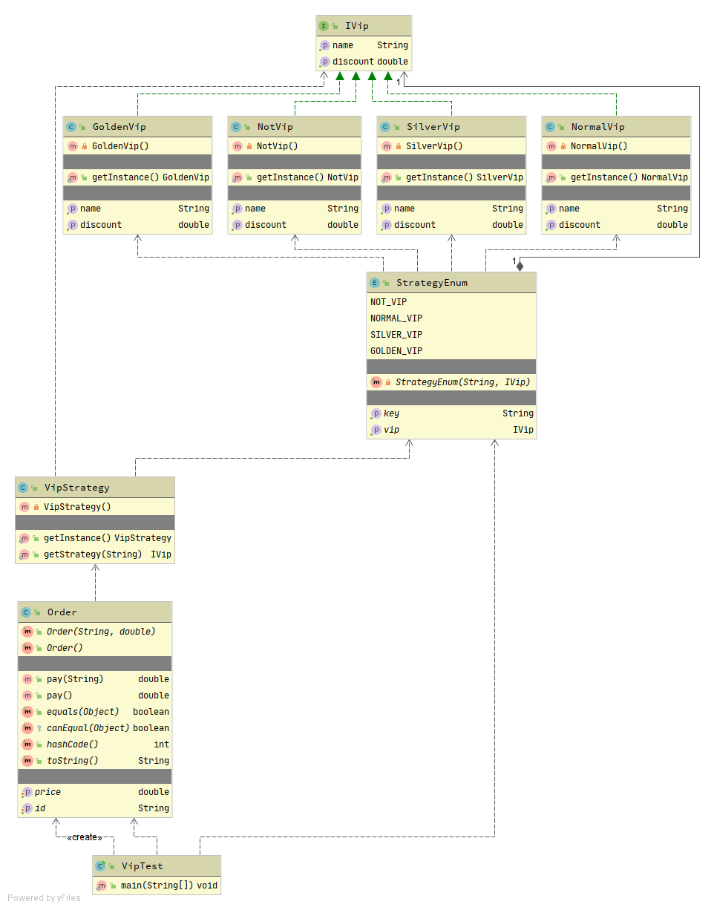

# 1、利用策略模式重构一段业务代码。

* 利用策略模式实现不同会员等级的用户购买商品时的价格计算

* 参见代码[strategy-responsibilitychain-homework](./strategy-responsibilitychain-homework)

* 类图如下:

# 2、请描述出责任链模式和建造者模式结合应用的精髓。

* 建造者模式用于构建责任链, 它用于决定链的结构, 链中节点的顺序

* 责任链模式用于减少逻辑判断, 客户端无需知晓其内部实现细节