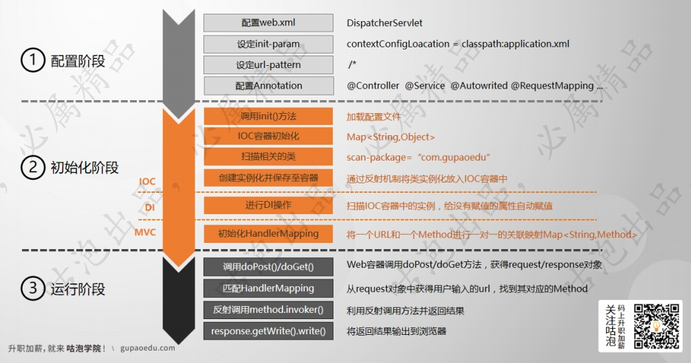

# 1、请用自己的语言描述Spring IOC、DI、MVC的基本执行原理。

Spring IOC, DI, MVC的执行主要分为三个阶段

1. 配置阶段: 主要完成web.xml和Annottation的配置
2. 初始化阶段: 完成IOC容器初始化, DI自动注入和HandlerMapping的初始化
3. 运行阶段: 根据用户请求的URL调用对应的Method, 将结果打印到浏览器.

详细过程如下图所示:

# 2、Spring中的Bean是线程安全的吗？为什么？。

不一定. Bean是由用户来编写的, 其是否线程安全取决于编写者