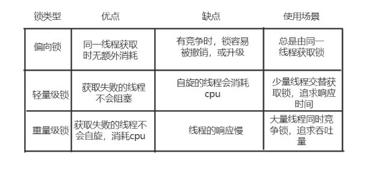

# 1. 下面这个程序的最终结果是多少？为什么？

```java
  public class SynchronizedDemo  {
     static Integer count=0;
     public static void incr(){
         synchronized (count) {
             try {
                 Thread.sleep(1);
             } catch (InterruptedException e) {
                 e.printStackTrace();
             }
             count++;
         }
     }
      public static void main(String[] args) throws IOException, InterruptedException {
          for(int i=0;i<1000;i++){
              new Thread(()->SynchronizedDemo.incr()).start();
          }
          Thread.sleep(5000);
          System.out.println("result:"+count);
      }
  }
```

值不一定, 因为count是Integer类型, 在进行自增操作的时候, 会进行装箱拆箱, 每次都会创建新的变量

# 2. 什么是偏向锁、轻量级锁、重量级锁，它们的作用是什么？

偏向锁
* 一个线程获取某个对象的偏向锁的成本是很低的，只需把对象头的偏向线程id改为自己就好，如果偏向线程id已经为自己则直接获得锁。当偏向锁的获取出现竞争，则偏向锁可能会升级为轻量级锁。
* 根据这些，可以看出偏向锁适合无竞争、竞争小的场景，理想的情况为总是由同一个线程去访问同步块、获取某个对象的锁。实际应用中，很多时候情景也确实是这样的。

轻量级锁
* 轻量级锁由偏向锁升级而来，特点是获取轻量级锁的是通过CAS原子操作进行的，失败的线程不会进入阻塞，而是自旋尝试再次CAS去获取锁。若失败的次数过多，则轻量级锁会膨胀为重量级锁。因为自旋也是要消耗cpu的，不能让线程一直自旋下去。
* 根据这些，可以看出 轻量级锁最适合场景是追求响应时间的情景，理想的情况是少量线程交替访问同步块、获取锁。若多个线程访问同步块的时间重合的比骄密集就会发生很多自旋造成cpu资源浪费。

重量级锁
* 重量级锁是轻量级锁受到激烈竞争时，为防止cpu被自旋的线程浪费膨胀而来，因此重量级锁肯定是应付大量线程同时访问同步块的情景。让申请锁失败的线程阻塞后，cpu的负担会减小不少，因此数据的吞吐量也就上来了。


汇总表格：

